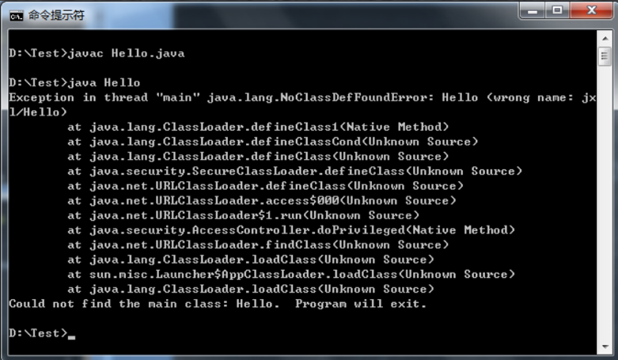

#chapter 1
1. 要求下节课之前各位同学，都需要在自己笔记本中安装好`Java SE`(>= Java 8)的开发平台，推荐使用文本编辑器进行学习，有利于打牢基础，且课堂检查程序，要求同学使用命令行。
如果实在依赖`IDE`，则推荐`IntelliJ IDEA` 社区版（免费版本），包含专业版的部分功能，但已经足够强大，包含本课程所需要的全部特性。
2. 同学们已经学习过了多种编程语言，学习程序初期，需要一些输入操作配合输出操作来进行交互，例如`C`语言的`scanf`和`printf`，`C++`的`cin`和`cout`等，目前我们仅学习了java的输出操作`System.out.println`，如何在不借助于输入方法，直接通过命令行向主方法中传参？
请同学们，课后查阅资料完成此题，并自己编写简单的示例程序来演示。下节课会随机抽查，如果使用IDE开发也需要掌握命令传参的方法。
3. 要求同学课后探索`JShell`的更多功能，可以参考这篇[博文](https://www.cnblogs.com/IcanFixIt/p/7199108.html?utm_source=itdadao&utm_medium=referral)进行了解。
4. 要求同学着手开始建立起自己的编程资料库，在学习过程中可以将所得随时以博客或者笔记的方式记录下来，推荐在`GitHub`或者“码云”上申请帐号，创建个人的项目，并且平时应该将一些可以重用的代码整理好，放入自己的代码仓库以便随时取用；笔记推荐使用蚂蚁笔记，支持`Markdown`与`latex`公式且自带博客。 
5. **重点：要求学习版本管理工具`git`的使用，今后的实验都会要求提交完整的git版本库进行查重。**本[链接](http://blog.csdn.net/free_wind22/article/details/50967723)仅供参考，建议同学自行查找相关资料进行学习。
	
	**补充资料**：
	* 各位同学可以使用[廖雪峰的git教程](https://www.liaoxuefeng.com/wiki/0013739516305929606dd18361248578c67b8067c8c017b000/)进行学习，要求掌握git的基本操作（建立版本库，添加文件，提交，分支切换，合并等）
	* 阮一峰的日志中，对于git的使用总结非常漂亮，推荐各位在今后的git使用过程中反复阅读:
		* [远程操作详解](http://www.ruanyifeng.com/blog/2014/06/git_remote.html)，5星推荐
		* [git工作流程](http://www.ruanyifeng.com/blog/2015/12/git-workflow.html)，对各位同学初学git，推荐使用git flow模式来管理你们的版本库
		* [git使用规范](http://www.ruanyifeng.com/blog/2015/08/git-use-process.html)，简洁明了
		* [分支管理策略](http://www.ruanyifeng.com/blog/2012/07/git.html)，5星推荐
	* 参考书《pro git》，在ftp上。


#chapter 2
1. 本章介绍了Java的文档注释，需要同学们根据提供的[链接](https://www.cnblogs.com/boring09/p/4274893.html)对文档注释以及`javadoc`命令的使用进一步自学，要求对附件中提供的示例程序`DocTest.java`，独立运行`javadoc`命令得到完整的文档注释，压缩提交。**注意：码云仓库中提供的测试用例与讲义中有所不同，多了第一行的包声明语句，需要同学们进一步自学后对讲义提供的javadoc命令稍作修改。**（今后的实验，会要求提交文档注释的生成网页）
2. 各位同学在学习c语言的时候，肯定练习过冒泡排序、水仙花数、完数、回文串等小程序，为了进一步熟悉Java的语法基础，要求同学们将这些程序，使用Java语言进行改写并提交！
要求：每个小程序单独一个类，类名即如下给出的文件名，每个类中包含一个main方法。
```
程序清单:
	1. 冒泡排序 BubbleSort.java
	2. 水仙花数 NarcissisticNumber.java
	3. 完数 PerfectNumber.java
	4. 判断回文串 IsPalindromicString.java
	5. 最长回文子串 LongestPalindromicSubstring.java
	6. 中位数（借助快速排序的思想） Median.java
	7. 异或加密 XOREncryption.java
	8. 快速判断大整数的奇偶 IsBigNumberOdd.java
	9. 不借助于临时变量，实现两个变量的交换 Exchange.java
	10. 选择排序  SelectionSort.java
	11. 插入排序  InsertionSort.java
	12. 最大公约数  GCD.java
	13. 输出国际象棋棋盘 Chess.java（hint：char 219）
	14. 字符串逆序 ReverseString.java
	15. 二维矩阵乘法 MatrixMultiplication.java
```
3.  本章的示例程序多次使用了System.out.println()方法，很方便地输出了程序的运行结果，问题来了！“+”这个运算符，我们在System.out.println中也见过很多次了，如何理解？（请同学们编写示例程序回答以下问题）
	* “+”运算符左右两边都是字符串的时候，返回什么类型？左右的原字符串是否有变化？
	* “+”运算符左边字符串，右边基本类型（例如整型），返回什么类型？猜测内部可能的操作！
解释如下程序的运行结果，要求提交文字解说。
```
int x = 100;
int y = 200;
System.out.println("x+y="+x+y);
System.out.println(x+y+"=x+y");
```

##提交要求：
1. 提交一个压缩文件，文件名为“学号\_姓名”，例如“130824206\_李想”，要求压缩文件格式（rar，zip，tar.gz）,其他的压缩文件格式，脚本无法识别即0分，请确保压缩文件无损坏，若文件损坏视为0分;文件名中严格使用**下划线_**，其余的分隔符自动脚本无法识别，可能会判断为没有提交。
2. Deadline：2018.3.22日中午12点前，后台会运行自动脚本接收邮件，超时未交本次作业即为0分。
3. 提交方式：发送邮件至 bfu\_java\_ta@126.com ，邮件的主题为 “chapter2\_homework\_学号”，将压缩文件作为附件，后台的自动脚本接收邮件，所以主题请严格按照要求书写。
4. 另外，请同时提交一份压缩文件至ftp的课程目录的作业中作为备份。
5. 压缩文件中的内容，请包括3个目录分别对应3个作业。

#chapter 3
1. 对于如下程序中`Tom`类的两个实例，`cat1`和`cat2`在内存中成员变量的内存如何分配，请按照讲义的画法，画出内存分配图（电子版或者手绘版照片均可）。
```
class Tom {
	final int MAX = 100;
	static final int MIN = 20;
}
public class Test {
	public static void main(String[] args) {
		System.out.println(Tom.MIN);
		Tom cat1 = new Tom();
		Tom cat2 = new Tom();
		int x = Tom.MIN + cat1.MAX + cat2.MAX;
		System.out.println(x);
	}
}
```
2. 在如下的参数个数可变的方法的方法重载的代码示例中，请思考1~4条`test()`方法依次会调用哪个`test()`方法。
```
public class OverloadVarargsTest {
	public void test(String msg) {
		System.out.println("只有一个字符串参数的test方法 ");
	}
	// 因为前面已经有了一个test()方法，test()方法里有一个字符串参数。
	// 此处的长度可变形参里不包含一个字符串参数的形式
	public void test(String... books) {
		System.out.println("****形参长度可变的test方法****");
	}

    public static void main(String[] args) {
		OverloadVarargsTest olv = new OverloadVarargsTest();
		olv.test();
		olv.test("aa");
		olv.test(new String[]{"aa"});
		olv.test("aa" , "bb");
	}
}
```
3. 对于如下的原文件中添加了`package语句`之后，使用命令行运行出现了如图所示的Error，请思考原因，并且通过查阅资料，找出使用`jdk命令行工具`正确运行含有package语句的java程序的方法。
```
package jx1;
public class Hello {
	public static void main(String[] args) {
		System.out.println("Hello World!");
	}
}
```

4. 了解`Jar`命令，如何创建归档文件。用Java编写一个`MathOpt类`，其中使用Java提供的Math类，自己编写一些一些代码，封装一些数学函数功能，把此类放入`MathPackage`包中，和提供的测试类一起使用jar命令打包成一个可运行的Jar包。
5. private访问控制符可以修饰一个类的构造器，请同学思考，这个特性是否有必要？
	* 若无必要，请至少给出三点理由，若有必要，请写出示例代码，需要提交的你的结论！
	* 参考：设计模式之单例模式
6. `==运算符`在比较引用类型变量时，只有在两个引用都指向了同一个对象时才返回真值。那么，字符串的字面值比较该如何做呢？请同学们查找Java API给出答案，并给出示例程序。
7. 本章节学习完成之后，我们终于迈上了重构之旅，lab1是本章最后的大魔王！各位同学请迎接挑战。

#chapter 4
1. 思考如下代码是否会发生编译错误，请简要阐述
```
public class PrivateFinalMethodTest {
	private final void test();
}
class Sub extends PrivateFinalMethodTest {
	public void test();
}
```
2. 请根据第3章和第4章所学内容，对涉及到的关键字及其用法进行总结：
	* 要求使用自己组织语言，不能照抄书本以及课件，如果需要可以配上代码说明。
	* 请至少包含如下关键字：
		* `final` `static` `abstract`（重点要求，需要总结可使用的类成员类型及其效果）
		* `private` `protected` `public` `default`
		* `class` `enum` `extends` `interface`
3. 思考为什么外部类的访问权限只能是`public`或者`default`；而内部类的访问权限，可以使用所有的访问修饰符？
4. 到目前为止，我们已经学习了Java语言对于面向对象所支持绝大部分特性，已经具备足够的能力去阅读JDK中的部分源代码！代码阅读任务——`BigInteger`类要求：
	1. 通过阅读源码，理解对于“大整数”的存储原理
	2. 理解加减乘除的基本操作以及`BigInteger`的各个构造器
	3. 梳理源码中各种学习过的知识点，并列举出源码中不理解的点
5. 使用`javac`命令编译课件中内部类以及枚举类的示例代码（若未提供源码，请自行编写），观察编译后生成的class文件，并自行总结编译得到class文件的命名规则。
6. 学习完本章的内容之后，我们就可以基于lab1正式开始重构之旅了！lab2和lab3，接二连三的挑战！

#chapter 5
1. 我们提供了一份非常优秀的正则表达式教程，强烈建议各位同学将该教程完整学习一遍！
	* 自学要求：
		* 熟悉基本的正则表达式语法，要求掌握Pattern和Matcher两个类的使用方式。
		* 包括量词、捕获组、边界判断等
	* 小练习：
		* 利用正则表达式，编写一个工具，检测用户输入的email是否正确。
2. Java 8 对日期时间类，有了重大改进，要求自学如何自定义日期时间的输出格式。
3. 比较是一件非常频繁的操作，与比较相关，Java为我们提供了两个接口，`Comparable`和`Comparator`接口，要求通过自学掌握这两个接口的用法。
4. 本章涵盖内容非常之广！我们又可以利用所学，继续我们的重构之旅，lab4相信一定不会难倒各位同学。
5. 经历了相当长一段时间的学习了！相信各位同学对于Java也有了一定程度的认识，PA1一个非常综合的实验，其中需要同学们自学Java 的`GUI编程`（当然我们提供了部分资料），从今天开始，你有为期两周的时间去完成PA1.

#chapter 6
#chapter 7
#chapter 8
