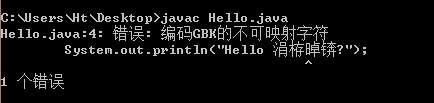
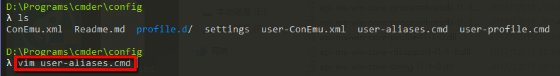
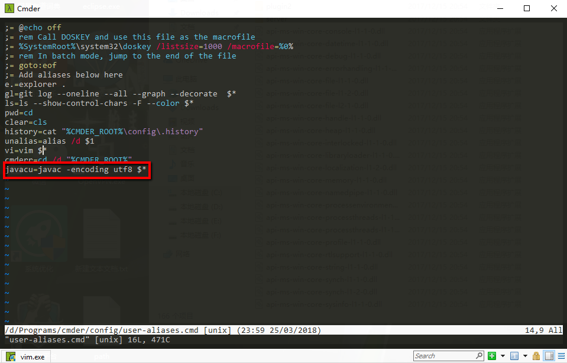
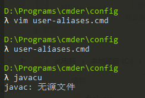
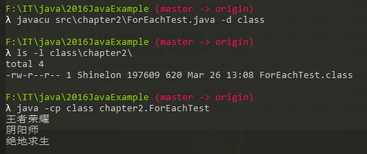

# 工欲善其事，必先利其器
## 关于 CLI 与 GUI
很多同学都习惯使用图形界面化（GUI, Graph User Interface）的操作系统（Window，Mac OS X），如果有使用过ssh登入过远程服务器的同学，面对的是完全的命令行界面 CLI (Command Line Interface)，第一次面对CLI，很多人第一反应都是空虚、压抑、绝望...

冷静！！！你是否思考过，有什么事是你在CLI下可以完成，但在GUI下做不到的？
有任何想法吗？
换一个问题，如果你被要求统计你在程序设计基础课程上所写过的所有程序的总行数，你会怎么做？

如果你坚持使用Visual Studio，你永远不会明白为什么`vim`被称为[编辑器之神](http://os.51cto.com/art/201101/242518.htm)。
如果你坚持Windows，你永远不会知道什么是[Unix哲学](http://en.wikipedia.org/wiki/Unix_philosophy)。
如果你坚持GUI，你只能做它可以做的事情; 但在CLI中，它可以做你想做的事情。
像你这样的年轻人最重要的精神之一就是尝试新事物来告别过去。

当你做某些事情需要高清晰度显示时，GUI会胜出，比如看电影。
但在我们的实验中，GUI是不必要的。
这里有两篇文章讨论GUI和CLI之间的比较：
* [Why Use a Command Line Instead of Windows?](http://www.linuxdevcenter.com/pub/a/linux/2001/11/15/learnunixos.html) 
* [Command Line vs. GUI](http://www.computerhope.com/issues/ch000619.htm)

## Shell终端
在计算机中，[Shell](https://en.wikipedia.org/wiki/Shell_(computing))俗称壳（用来区别于核，即操作系统内核），是指“提供使用者使用界面”的软件（**命令解析器**）。它类似于DOS下的cmd.exe。它接收用户命令，然后调用相应的应用程序。
我们刚刚为大家科普了`CLI`的强大，实际上很多时候，当你需要在公司服务器或者实验室提供的集群上进行开发实验的时候，你不得不面对纯命令行的操作方式。优秀的shell终端能够为我们日常工作和开发提高效率，对于windows下的dos或者powershell而言，使用体验实在说不上好，界面丑不说，部分使用规定甚至有些反人类，接下来将为各位推荐windows和mac下各一款优秀的shell终端。

### Cmder
[Cmder](http://cmder.net/)是一个增强型命令行工具，不仅可以使用windows下的所有命令，更爽的是可以使用部分linux下的bash命令。
cmder具备如下特点：
* 便携，解压即可用，你甚至可以放到USB就可以虽时带着走，连调整过的设定都会放在cmder目录下。
* 自带ls、curl等命令，**此处推荐各位下载完整版的Cmder（With Git for windows）**
* 可设置命令别名（alias）
* 丰富的颜色主题（Solarized、Twilight、Ubuntu、xterm、Monokai，甚至接受自定）、可定制字体
* 支持tab分页、同屏多端口（支持水平分割、垂直分割）
* 支持自定terminal，无论是CMD、PowerShell、**bash**都可以，还可以注入环境变量。

#### alias 
`alias`命令用来设置指令的别名。我们可以使用该命令可以将一些较长的命令进行简化。
一些使用windows的同学之前问过我，使用`javac`命令编译`utf8`编码的Java源文件时，会遇到如下错误：

通过错误提示，我们可以发现这是一个编码相关的问题。`javac`会使用系统默认编码编译Java源文件，而同学们使用的windows系统默认编码一般为`GBK`，因此使用`GBK`编码去编译`utf8`的Java源文件发生了编译错误。（而各位同学使用的Mac OS X在汉语使用区的默认编码一般为`utf8`，可以通过`locale`命令查看，因此不会遇到上述问题。）

解决方案是在使用`javac`时，指定源文件的具体编码`javac -encoding utf8`。于是乎，问题来了，每一次编译`utf8`编码的Java源文件，都需要输入`javac -encoding utf8 ***.java`的完整命令，稍显冗长。

此时，`alias`命令就可以大显身手，我们演示利用`Cmder`自带的`alias`功能，为`javac -encoding utf8`取一个别名`javacu`。（**注意：Cmder的alias功能与传统的linux下的bash的alias命令有所差异。**）
1. 运行Cmder，此时Cmder目录下的config子目录下会生成如下图所示的各式配置文件，编辑`user-aliases.cmd`文件（截图展示了使用`vim`编辑文件，由于`vim`具备一定的学习成本，各位同学可以使用习惯的编辑器编辑。）

2. 在文件尾添加`javacu=javac -encoding utf8 $*`，保存退出

3. 运行`user-alaises.cmd`命令 （注意：请在config目录下运行该命令）
4. 运行`javacu`命令，此时我们可以看到，提示“无源文件”，可见`javacu`命令已被识别，只是我们没有输入待编译的源文件。

    

5. 进入包含有Java源文件的目录，使用`javacu`进行测试。

### iTerm2 & ZSH
使用Mac的同学，Mac自带一个终端，但也比较朴素，尤其对于色彩支持上功能有限。推荐使用`iTerm2 & ZSH`的组合，功能非常强大且美观，此处不详细介绍，提供了一个[链接](http://wdxtub.com/2016/02/18/oh-my-zsh/)，网上关于这方面的配置非常多，各位同学可以自行搜索配置。

